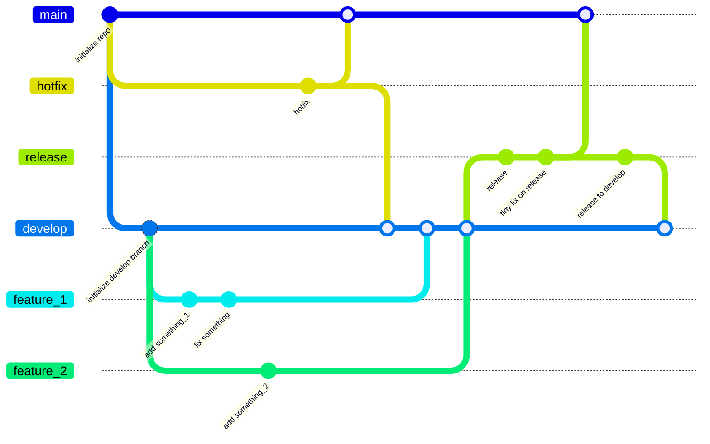

# gitflow-ci-example
example for git-flow ci

## status

- GitFlow
  - [x] Release
    - [x] Release to Main
    - [x] Release to Develop (after release to main PR merged into main branch)
  - [ ] Hotfix
- [ ] Workflow Run
